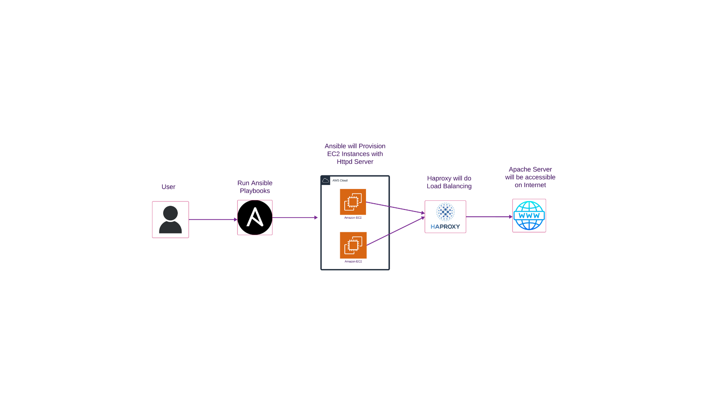

# Dynamic Inventory Load Balancing using Ansible 🚀

## Introduction 📝

This project is about creating a dynamic inventory for load balancing using Ansible. In this project, I have used the AWS EC2 instances as the inventory servers and HAProxy as the load balancer. The project is divided into two parts. The first part is about creating the dynamic inventory hosts and the second part is about dynamically updating the HAProxy configuration file.

## Project description 📄

In this Project, I utilized Ansible automation to streamline the provisioning and management of cloud-based infrastructure, In my case I used AWS EC2 instances. The primary goal is to automate the deployment of web servers using Apache HTTP Server (httpd) on dynamically provisioned EC2 instances and orchestrate a dynamic load balancer with HAProxy for distributing incoming traffic across these instances.

## Architecture 🏗️



## Features 🌟

- **Dynamic Inventory**: The EC2 instances are dynamically added to the inventory file using the Jinja2 template.
- **Load Balancing**: The HAProxy configuration file is dynamically updated with the IP addresses of the EC2 instances.


## Prerequisites 📋

- AWS Account
- IAM User with programmatic access
- Linux OS (I used Amazon Linux 3)

## Usage Guide 📖

Follow these steps to use this repository:

### Getting Started 🚦

1. **Clone the repository to your local machine:**

   ```bash
   git clone https://github.com/mathesh-me/ansible-dynamic-inventory-lb
    ```

2. **Change the directory to the cloned repository:**

    ```bash
    cd ansible-dynamic-inventory-lb
    ```
3. **Update the `aws_access_key` and `aws_secret_key` in the `aws_credentials.yml` file.**

4. **Update the `key.pem` file with your AWS key pair.**

5. **Update the `aws_ec2_configs.yml` file with your EC2 instance configurations.**

6. Run the `haproxy.yml` playbook to install HAProxy on the localhost:

    ```bash
    ansible-playbook haproxy.yml
    ```
7. Update the haproxy.j2 file as per instructions in the file.

8. Run the `create_instance.yml` playbook to create the EC2 instances:

    ```bash
    ansible-playbook create_instance.yml
    ```
9. Run the `httpd.yml` playbook to install the Apache HTTP Server on the EC2 instances:

    ```bash
    ansible-playbook httpd.yml
    ```
10. Run the `load_balancer.yml` playbook to create the dynamic inventory:

    ```bash
    ansible-playbook load_balancer.yml
    ```
11. Now you can access the load balancer using the public IP address of the load balancer on port 5000.


## Technologies Used 🛠️

- [Ansible](http://ansible.com)
- [AWS](http://aws.amazon.com)
- [HAProxy](https://www.haproxy.org/)
- [Jinja2](https://jinja.palletsprojects.com/en/3.0.x/)

## Author 🧑‍💻

- [kader Khan](https://www.linkedin.com/in/abir-k/)

## License 📜

This project is licensed under the MIT License - see the [LICENSE](LICENSE) file for details.

## Contributing 🤝

Contributions are always welcome! If you have any suggestions or improvements, feel free to create an issue or a pull request.
