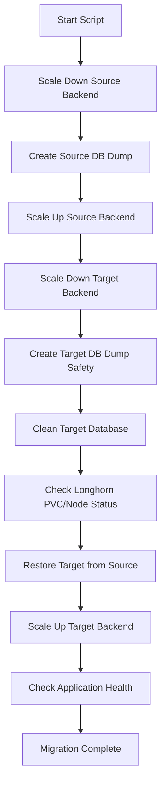
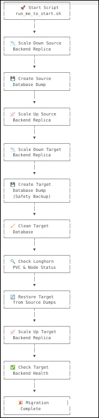

# 🚀 Kubernetes Database Migration Script with Ansible

[](https://kubernetes.io)
[](https://longhorn.io)
[](https://www.gnu.org/software/bash/)
[](LICENSE)

A robust and automated script for database migration in Kubernetes environments using Longhorn storage. This script ensures safe and efficient database backup, cleanup, and restoration with proper pod scaling and health checks.

## ✨ Features

- 🔍 **Longhorn Storage Monitoring**: Automatically checks Longhorn storage availability and displays pod status
- 📦 **Automated Database Backup**: Creates safe dumps of both source and target databases
- 🔄 **Smart Pod Scaling**: Automatically scales down/up backend replicas to ensure clean operations
- 🧹 **Database Cleanup**: Safely cleans target database before restoration
- 🔄 **Database Restoration**: Restores target database from source dumps
- 💚 **Health Monitoring**: Checks application health status after migration
- ⚡ **One-Click Execution**: Simple script execution with proper permissions


## 📁 Project Structure

```
project-root/
├── ansible.cfg                    # Ansible configuration file
├── dumps/                         # Database dump files
│   ├── corteza_from_172.17.17.160.dump
│   └── corteza_from_172.17.17.163.dump
├── image.png                      # Workflow diagram image
├── inventories/
│   └── var.ini                    # Configuration variables
├── kubeconfig/
│   └── kubeconfig                 # Kubernetes configuration file
├── logs/                          # Execution logs
│   └── ansible_migration_20250807_093901.log
├── playbooks/
│   └── main.yaml                  # Main Ansible playbook
├── readme.md                      # Project documentation
├── roles/                         # Ansible roles
│   ├── common-scale/              # Role for scaling operations
│   │   └── tasks/
│   │       ├── replica-down.yaml  # Scale down replicas
│   │       └── replica-up.yaml    # Scale up replicas
│   ├── longhorn-storage-check/    # Role for Longhorn storage validation
│   │   └── tasks/
│   │       └── storage-availability.yaml
│   ├── mysql/                     # MySQL database operations
│   │   └── tasks/
│   │       ├── clean-target-db.yaml
│   │       ├── create-source-db-dump.yaml
│   │       ├── create-target-db-dump.yaml
│   │       └── restore-db.yaml
│   └── postgres/                  # PostgreSQL database operations
│       └── tasks/
│           ├── clean-target-db.yaml
│           ├── create-source-db-dump.yaml
│           ├── create-target-db-dump.yaml
│           └── restore-db.yaml
└── run_me_to_start.sh             # Main execution script
```

## 🎯 Prerequisites

Before you begin, ensure you have the following installed:

- ✅ **Kubernetes Cluster** (v1.20 or higher)
- ✅ **Longhorn Storage** (v1.2 or higher) installed and configured
- ✅ **kubectl** command-line tool installed
- ✅ **Bash** shell environment
- ✅ **Proper permissions** to manage Kubernetes resources
- ✅ **Database access** credentials for both source and target

## 🛠️ Installation

1. **Clone the repository** (if applicable):
   ```bash
   git clone <repository-url>
   cd <project-directory>
   ```

2. **Make the script executable**:
   ```bash
   chmod +x run_me_to_start.sh
   ```

## ⚙️ Configuration

### 1. Configure Variables

Edit the configuration file located in the inventories directory:

```bash
nano ./inventories/var.ini
```

**Required configuration parameters:**
- Source database connection details
- Target database connection details
- Kubernetes namespace information
- Longhorn storage class names
- Pod deployment names
- Replica count settings

### 2. Setup Kubeconfig

Place your Kubernetes configuration file in the designated directory:

```bash
# Copy your kubeconfig file to the required location
cp ~/.kube/config ./kubeconfig/
```

**Ensure the kubeconfig file has proper permissions and access to:**
- List and manage pods
- Scale deployments
- Access Longhorn storage resources
- Manage PVCs and storage classes

## 🚀 Usage

Execute the migration script with a single command:

```bash
./run_me_to_start.sh
```

**The script will:**
1. Validate configuration and prerequisites
2. Check Longhorn storage availability
3. Display storage pod status
4. Execute the complete migration workflow
5. Provide real-time progress updates
6. Perform final health checks

## 📊 Workflow


Visual representation of the workflow:




## 🔍 Detailed Steps

### Step 1: Source Database Preparation
- **Scale down** source backend replica to prevent interruptions
- **Create database dump** of the source database
- **Scale up** source backend replica after successful dump creation

### Step 2: Target Database Preparation
- **Scale down** target backend replica for safe operations
- **Create safety dump** of target database (backup before cleanup)
- **Clean target database** to prepare for restoration

### Step 3: Storage Validation
- **Check Longhorn PVC status** and availability
- **Verify node status** for Longhorn storage components
- **Display storage pod status** and any relevant messages

### Step 4: Database Migration
- **Restore target database** from source dumps
- **Scale up target backend replica** after successful restoration
- **Perform health checks** on target backend application


## 🛡️ Safety Features

- ✅ **Automatic Rollback**: Script includes error handling for rollback scenarios
- ✅ **Backup Before Cleanup**: Always creates safety dumps before destructive operations
- ✅ **Health Validation**: Comprehensive health checks at each stage
- ✅ **Resource Monitoring**: Monitors pod and storage status throughout
- ✅ **Graceful Scaling**: Ensures applications remain available during scaling operations

## 🐛 Troubleshooting

### Common Issues

1. **Permission Denied**
   ```bash
   # Ensure script is executable
   chmod +x run_me_to_start.sh
   ```

2. **Kubernetes Connection Issues**
   ```bash
   # Verify kubeconfig file and permissions
   kubectl cluster-info
   ```

3. **Longhorn Storage Not Available**
   ```bash
   # Check Longhorn pods status
   kubectl get pods -n longhorn-system
   ```

4. **Database Connection Errors**
   - Verify database credentials in `var.ini`
   - Check network connectivity between pods
   - Ensure database services are running

### Log Files

Check the logs directory for detailed execution logs:
```bash
tail -f logs/migration_$(date +%Y%m%d).log
```

<div align="center">

**⭐ If this project helped you, please give it a star!**

Made with ❤️ by DevOps Team of AESL

</div>