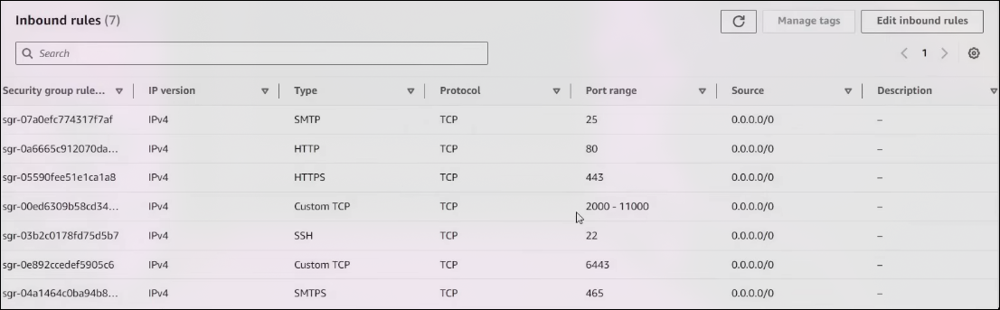

# Need to Optimise More with various Information


## CI/CD Pipeline Setup with Jenkins, Nexus, and SonarQube

This document provides a step-by-step guide to setting up a CI/CD pipeline using Jenkins, Nexus, and SonarQube on AWS EC2 instances. The setup includes configuring the necessary virtual machines, installing required tools, and integrating the tools into a Jenkins pipeline.

---

## Table of Contents
1. [Prerequisites](#prerequisites)
2. [AWS VM Setup](#aws-vm-setup)
3. [Jenkins Server Setup](#jenkins-server-setup)
4. [Nexus Server Setup](#nexus-server-setup)
5. [SonarQube Server Setup](#sonarqube-server-setup)
6. [Pipeline Configuration](#pipeline-configuration)
7. [Adding Images to README](#adding-images-to-readme)
8. [Conclusion](#conclusion)

---

## Prerequisites

- **GitHub Repository**: Ensure you have a GitHub repository with a valid Personal Access Token (PAT) for access.
- **AWS Account**: An active AWS account with permissions to create EC2 instances and configure security groups.
- **Knowledge**: Familiarity with Linux commands, Docker, Jenkins, Nexus, and SonarQube.

---

## AWS VM Setup

1. **Create EC2 Instances**:
   - Launch three EC2 instances with the following specifications:
     - **Jenkins Server**: `t2.large` (8GB RAM, 2 vCPUs) - In this example
     - **Nexus Server**: `t3.medium` (minimum requirement of 4GB RAM, 2 vCPUs)
     - **SonarQube Server**: `t3.medium` (4GB RAM, 2 vCPUs)

2. **Configure Security Groups**:
   - Open the following ports in the security group:
     

---

## Jenkins Server Setup

1. **Update and Install Java**:
   ```bash
   sudo apt update
   sudo apt install openjdk-17-jdk -y
   ```

2. **Install Jenkins**:
   ```bash
   sudo wget -O /usr/share/keyrings/jenkins-keyring.asc \
     https://pkg.jenkins.io/debian-stable/jenkins.io-2023.key
   echo "deb [signed-by=/usr/share/keyrings/jenkins-keyring.asc]" \
     https://pkg.jenkins.io/debian-stable binary/ | sudo tee \
     /etc/apt/sources.list.d/jenkins.list > /dev/null
   sudo apt-get update
   sudo apt-get install jenkins -y
   ```

3. **Install Docker**:
   ```bash
   sudo apt-get update
   sudo apt-get install ca-certificates curl -y
   sudo install -m 0755 -d /etc/apt/keyrings
   sudo curl -fsSL https://download.docker.com/linux/ubuntu/gpg -o /etc/apt/keyrings/docker.asc
   sudo chmod a+r /etc/apt/keyrings/docker.asc
   echo \
     "deb [arch=$(dpkg --print-architecture) signed-by=/etc/apt/keyrings/docker.asc] https://download.docker.com/linux/ubuntu \
     $(. /etc/os-release && echo "$VERSION_CODENAME") stable" | \
     sudo tee /etc/apt/sources.list.d/docker.list > /dev/null
   sudo apt-get update
   sudo apt-get install docker-ce docker-ce-cli containerd.io docker-buildx-plugin docker-compose-plugin -y
   ```

4. **Install Trivy**:
   ```bash
   sudo apt-get install wget gnupg -y
   wget -qO - https://aquasecurity.github.io/trivy-repo/deb/public.key | gpg --dearmor | sudo tee /usr/share/keyrings/trivy.gpg > /dev/null
   echo "deb [signed-by=/usr/share/keyrings/trivy.gpg] https://aquasecurity.github.io/trivy-repo/deb generic main" | sudo tee -a /etc/apt/sources.list.d/trivy.list
   sudo apt-get update
   sudo apt-get install trivy -y
   ```

5. **Install kubectl**:
   ```bash
   sudo snap install kubectl --classic
   ```

---

## Nexus Server Setup

1. **Update and Install Docker**:
   ```bash
   sudo apt update
   sudo apt install docker.io -y
   ```

2. **Run Nexus Container**:
   ```bash
   sudo docker run -d -p 8081:8081 --name nexus sonatype/nexus3
   ```

3. **Access Nexus**:
   - Wait a few minutes for Nexus to initialize.
   - Access the Nexus UI at `http://<VM_IP>:8081`.
   - Retrieve the admin password:
     ```bash
     sudo docker exec -it nexus cat /nexus-data/admin.password
     ```
   - Log in with the admin password and set a new password. Enable anonymous access during setup.

---

## SonarQube Server Setup

1. **Update and Install Docker**:
   ```bash
   sudo apt update
   sudo apt install docker.io -y
   ```

2. **Run SonarQube Container**:
   ```bash
   sudo docker run -d -p 9000:9000 --name sonarqube sonarqube:lts-community
   ```

3. **Access SonarQube**:
   - Access the SonarQube UI at `http://<VM_IP>:9000`.
   - Log in with the default credentials (admin/admin) and configure the initial setup.

---

## Pipeline Configuration

1. **Install Jenkins Plugins**:
   - Go to `Manage Jenkins > Plugins > Available Plugins` and install the following plugins:
     - SonarQube Scanner
     - Config File Provider
     - Kubernetes, Kubernetes Credentials, Kubernetes CLI, Kubernetes Client API
     - Docker, Docker Pipeline
     - Pipeline Stage View

2. **Configure Tools**:
   - Go to `Manage Jenkins > Tools` and configure:
     - **Docker**: Add Docker installation and enable automatic installation.
     - **SonarQube Scanner**: Add SonarQube Scanner and enable automatic installation.

3. **Set Up SonarQube Server**:
   - Go to `Manage Jenkins > Credentials > System > Global Credentials`.
   - Add a new credential with Kind as `Secret text`, paste the SonarQube token, and set the ID as `sonar-token`.
   - Go to `Manage Jenkins > System`, find `SonarQube Servers`, and add the SonarQube server details.

4. **Create Jenkins Pipeline**:
   - Create a new pipeline job in Jenkins.
   - Configure the pipeline script according to your project requirements.

---

## Conclusion

This setup provides a robust CI/CD pipeline using Jenkins, Nexus, and SonarQube. You can now build, test, and deploy your applications with ease. For further customization, refer to the official documentation of each tool.

---