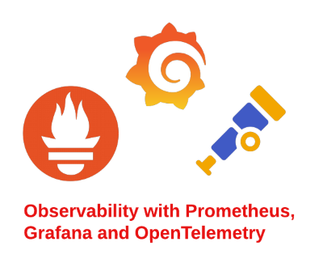

# Observability Study Guide

This repository contains the notes I have taken while studying the observability tools like Prometheus, Grafana, Loki, and OpenTelemetry. The notes are taken from the official documentation, Blogs, and some other resources. Use this repository as a reference guide for your study, Don't use this as a primary source of study. You can get some Hands-on experience by folloeing my Blogs and Github repositories mentioned in the Project section. You can also contribute to this repository by adding more notes or by correcting the existing notes.

    

## Resources Used

- [Prometheus Official Documentation](https://prometheus.io/docs/introduction/overview/)
- [Grafana Official Documentation](https://grafana.com/docs/grafana/latest/getting-started/what-is-grafana/)
- [Loki Official Documentation](https://grafana.com/docs/loki/latest/)
- [OpenTelemetry Official Documentation](https://opentelemetry.io/docs/)
- [Grafana Loki Youtube Playlist](https://youtube.com/playlist?list=PLDGkOdUX1UjpIWD3wTGGsiN4adkOq3LzQ&si=-NoLSXShaRV4kIUn)
- [Grafana Alloy Introduction](https://youtube.com/playlist?list=PLDGkOdUX1Ujo4nPEPvbeMayN8qilKkKF5&si=0sJjVhKMygRs6ESf)

## Table of Contents

| S.No | Topic | Official Documentation |
|------|-------|-----------------------|
| 1 | [Introduction to Observability](montoring-intro.md) | [Link](https://newrelic.com/blog/best-practices/what-is-observability) |
| 2 | [Prometheus and Grafana Introduction](prometheus-grafana-intro.md) | [Link](https://prometheus.io/docs/introduction/overview/) |
| 3 | [Prometheus Installation](prometheus/installation/) | [Link](https://prometheus.io/docs/prometheus/latest/installation/) |
| 4 | [Prometheus Data Collection](prometheus/data-collection/) | [Link](https://prometheus.io/docs/prometheus/latest/getting_started/) |
| 5 | [Prometheus Functions and Operators](prometheus/functions-operators/) | [Link](https://prometheus.io/docs/prometheus/latest/querying/functions/) |
| 6 | [Prometheus Retrieving Metrics](prometheus/retrieving-metrics/) | [Link](https://prometheus.io/docs/prometheus/latest/querying/basics/) |
| 7 | [Prometheus Alerting](prometheus/alerts/) | [Link](https://prometheus.io/docs/prometheus/latest/configuration/alerting_rules/) |
| 8 | [Prometheus Recording Rules](prometheus/recording-rules/) | [Link](https://prometheus.io/docs/prometheus/latest/configuration/recording_rules/) |
| 9 | [Prometheus Client Libraries](prometheus/client-libraries/) | [Link](https://prometheus.io/docs/instrumenting/clientlibs/) |
| 10 | [Prometheus Service Discovery](prometheus/service-discovery/) | [Link](https://prometheus.io/docs/prometheus/latest/configuration/configuration/#<file_sd_config>) |
| 11 | [Security in Prometheus](prometheus/security/) | [Link](https://prometheus.io/docs/prometheus/latest/configuration/basic_auth/) |
| 12 | [Grafana Introduction](grafana/grafana.md) | [Link](https://grafana.com/docs/grafana/latest/getting-started/what-is-grafana/) |
| 13 | [Grafana Installation](grafana/installation/) | [Link](https://grafana.com/docs/grafana/latest/installation/) |
| 14 | [Grafana Dashboards](grafana/grafana.md/) | [Link](https://grafana.com/docs/grafana/latest/getting-started/getting-started-prometheus/) |
| 15 | [Grafana Alerts](grafana/alerts/) | [Link](https://grafana.com/docs/grafana/latest/alerting/create-alerts/) |
| 16 | [Grafana Annotations](grafana/annotations/) | [Link](https://grafana.com/docs/grafana/latest/dashboards/annotations/) |
| 17 | [Grafana Administration](grafana/administration/) | [Link](https://grafana.com/docs/grafana/latest/administration/) |
| 18 | [Grafana Alloy](grafana/opentelemetry/grafana-alloy/) | [Link](https://grafana.com/docs/alloy/latest/) |
| 19 | [Loki Introduction](grafana/loki/) | [Link](https://grafana.com/docs/loki/latest/) |
| 20 | [OpenTelemetry](grafana/opentelemetry/) | [Link](https://opentelemetry.io/docs/) |

## Project

| S.No | Project | Description |
|------|---------|-------------|
| 1 | [Setting up a Seamless Monitoring Setup using Prometheus and Grafana] | Implementing a Comprehensive Monitoring System with Prometheus and Grafana, including Slack alerts setup and securing the Prometheus server |

## Tools Used

**Operating System**: Ubuntu 24.04 LTS

**Observability Tools**:
- `Prometheus`
- `Grafana`
- `Loki`
- `OpenTelemetry`

**IDE**: VS Code

## Contribution

You can Contribute to this repository by adding more notes, your blogs, projects, or any other resources related to observability tools. You can also correct the existing notes if you find any mistakes. All contributions are welcome.
