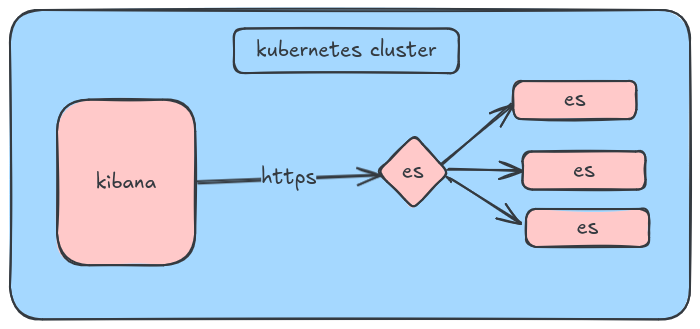

# Setting up EFK(elasticsearch fluentbit kibana) Stack

## Step 1 | Setup Elasticsearch On Kubernetes
- version `8.5.1`
- HELM Source: https://artifacthub.io/packages/helm/elastic/elasticsearch
- values file is available at `./elasticsearch/values.yaml`
- update the pvc section
```
volumeClaimTemplate:
	accessModes: ["ReadWriteMany"]
	storageClassName: longhorn
	resources:
		requests:
			storage: 50Gi
```
- update secret section
```
secret:
	enabled: true
		password: "elastic"
```
- update the request limit section
- **APPLY**
```
helm repo add elastic https://helm.elastic.co
helm upgrade --install elasticsearch -f values.yaml elastic/elasticsearch
```

## Step 2 | Setup Kibana On Kubernetes
- version `8.5.1`
- HELM Source: https://artifacthub.io/packages/helm/elastic/kibana 
- values file is available at `./kibana/values.yaml`
- **APPLY**
```
helm repo add elastic https://helm.elastic.co
helm upgrade --install kibana elastic/kibana --values values.yaml 	
```
- browse on `lb_ip:5601`
- credentials will be found on elasticsearch values.yaml file

