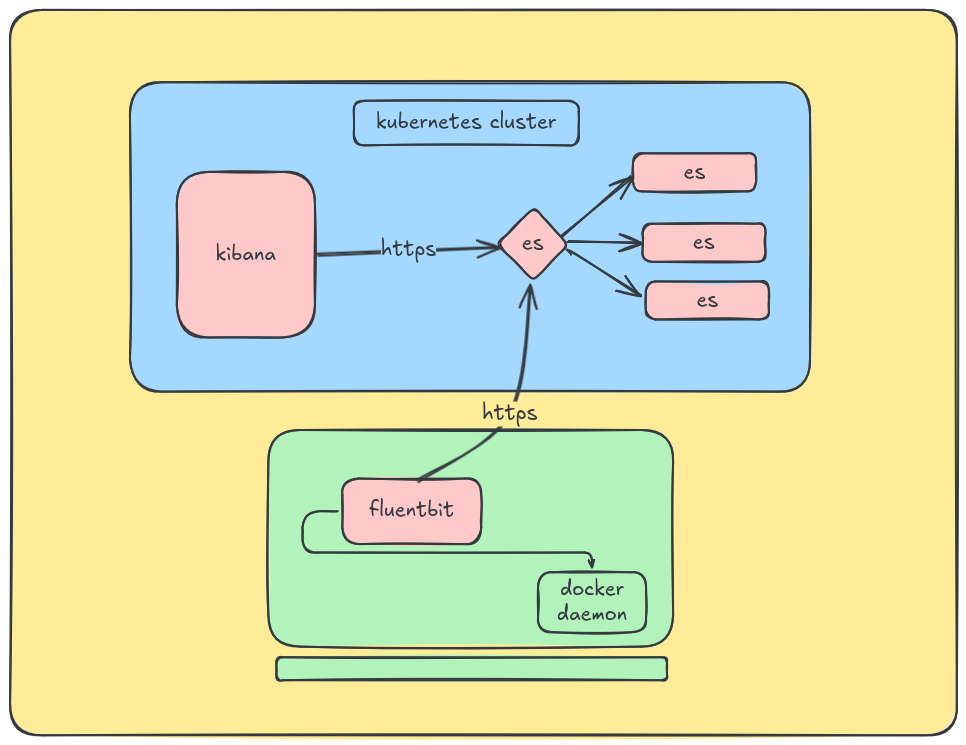

# collect-ship Docker daemon server logs
- these servers are external from kubernetes clusters
- make sure elasticsearch is exposed in loadbalancer



## 1. install
- install fluentbit
	- https://docs.fluentbit.io/manual/installation/getting-started-with-fluent-bit

## ubuntu 22.04

```
curl -s https://packages.fluentbit.io/fluentbit.key | gpg --dearmor | sudo tee /usr/share/keyrings/fluentbit-keyring.gpg > /dev/null

echo "deb [signed-by=/usr/share/keyrings/fluentbit-keyring.gpg] https://packages.fluentbit.io/ubuntu/jammy jammy main" | sudo tee /etc/apt/sources.list.d/fluentbit.list

sudo apt update
sudo apt install fluent-bit

```
## ubuntu 24.04
```
curl -s https://packages.fluentbit.io/fluentbit.key | gpg --dearmor | sudo tee /usr/share/keyrings/fluentbit-keyring.gpg > /dev/null
echo "deb [signed-by=/usr/share/keyrings/fluentbit-keyring.gpg] https://packages.fluentbit.io/ubuntu/noble noble main" | sudo tee /etc/apt/sources.list.d/fluentbit.list
sudo apt update
sudo apt install fluent-bit
```
<hr>

- configure fluentbit
	- `cd /etc/fluent-bit/`
	- edit `fluent-bit.conf`
```
[SERVICE]
    Flush        5
    Daemon       Off
    Log_Level    info
    Parsers_File parsers.conf
[INPUT]
    Name systemd
    Tag dockerd.*
    Systemd_Filter _SYSTEMD_UNIT=docker.service
    Read_From_Tail    True

[FILTER]
    Name record_modifier
    Match *
    Record hostname ${HOSTNAME}
[OUTPUT]
    Name es
    Match dockerd.*
    Host 172.17.19.61
    Port 9200
    TLS On
    TLS.Verify Off
    HTTP_User elastic
    HTTP_Passwd asdasdasd2131
    Index ${HOSTNAME}-docker-daemon
    Type _doc
    Suppress_Type_Name On
    Replace_Dots On
```
- start and enable
```
sudo systemctl enable fluent-bit
sudo systemctl restart fluent-bit
```


